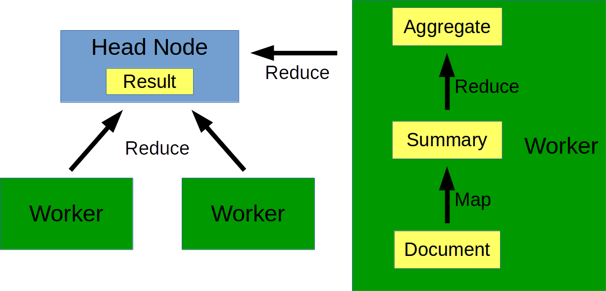

% Hands-on Apache Spark
% Dirk Hesse
% *iKnow Solutions Norge*

# What is Spark?

> **Apache Spark™** is a fast and general engine for large-scale data
> processing. 

- Distributed.
- Fast.
- General.
- In-memory.

---

## "100x faster than Hadoop"

\

Commuity (Sony)

---

# Myths and Facts

<table style="width: 80vw">
<tr>
<td>
![mb]\

Mythbusters (Discovery)
 
<td>
- Spark $\neq$ Hadoop!
- *Distributed*: You need a **cluster**.
- *In-memory*: You (sort of) need lots of **memory**.
- *Fast and general*: You need to write **code** (Scala, Java, Python,
  R).
</tr>
</table>

[mb]: img/Mythbusters.jpg {style="height: 50vh"}

---

# Spark in the wild

[http://spark.apache.org/powered-by.html](http://spark.apache.org/powered-by.html)

- eBay
    - Log transaction aggregation and analysis.
- Uber
    - Continous ETL (200k rides/day).
- TripAdvisor
    - Auto tagging (among others).
- Yahoo
    - Customized content.

---

# Input

<table style="width: 80vw">
<tr>
<td style="width: 20vw">
\

Victorinox

<td>
- Out of the box 
    - local files
    - HDFS
    - Cassandra
    - HBase
    - Amazon S3
    - ...
<td>
 - 3rd party packages
     - MongoDB
     - Power BI
     - Sequoia
     - Cloudant
     - Couchbase
     - Solr
     - salesforce
     - many more
</tr>
</table>

---

# Live Demo

[Reading Data]

---

# The RDD - At the ♥ of Spark.

---

# Live Demo

[RDD Demo]

---

# Behind the curtains: MapReduce

\

iKnow Solutions
 

---

# Beyond data exploration

\

Apache Foundation

---

# Spark SQL

[SQL]

---

# Deployment

<table>
<tr>
<td style="vertical-align: top">

### Managed Spark

- [Bluemix] (IBM)
- [AWS] (Amazon)
    - [Elastic Map Reduce][EMR] (EMR)
    - [spark-ec2] script
- [Azure] (Microsoft)

<td style="vertical-align: top">

### Hack your own

- Set up a cluster.
- Set up YARN.
- Download Spark.
- Good luck!

</tr>
</table>

---

# Q&A

\

Pulp Fiction (Miramax)

[Reading Data]: http://localhost:8888/notebooks/ReadData.ipynb
[RDD Demo]: http://localhost:8888/notebooks/RDD.ipynb
[SQL]: http://localhost:8888/notebooks/SQL.ipynb
[Bluemix]: https://www.ibm.com/cloud-computing/bluemix
[Azure]: https://azure.microsoft.com/
[AWS]: https://aws.amazon.com/
[EMR]: https://aws.amazon.com/emr/
[spark-ec2]: https://github.com/amplab/spark-ec2
